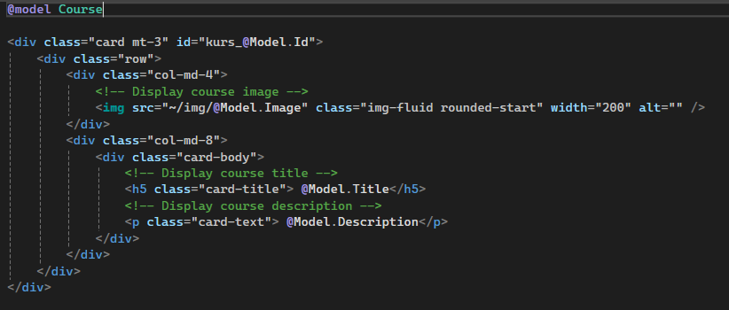

# .NET Çalışma Notlarım

**Sık Kullanılan HTTP Yanıt Kodları**

- 200: OK (İstek başarılı)
- 401: Unauthorized (Yetki Hatası)
- 403: Forbidden (Hatalı Erişim İsteği)
- 404: Not Found (Kaynak bulunamadı)
- 500: Internal Server Error (Sunucu içerisinde hata oluştu)

# Idempotent

Http metotlarından GET, PUT, DELETE **idempotent** yapıda iken POST idempotent değildir.

Peki nedir bu **idempotent**? Birden fazla defa çağırılmasında sakınca olmayan, nihai sonucu değiştirmeyecek çağrımlara idempotent yapıda diyebiliriz. Örneğin bir Http Get metodunu üst üste istediğiniz kadar çağırabilirsiniz. Bu sonucu değiştiremeyecektir. Yada Http Delete metodunu bir kere çağırdığınızda veriyi sildiğinizi düşünelim. 2. yada 3. çağrımlarda veride bir değişiklik olmaz. Zaten silinmiştir.

# **Rounting**

Startup.cs içersinde çeşitli konfigürasyonlar yapabiliriz. Varsayılan olarak aşağıdaki yapılandırma ayarı geliyor. 

https://www.abc.com/home/list

Buradaki ilk kısım protokol, ikinci kısım domain name, üçüncü kısım controller, dördüncü kısım ise action kısmına karşılık geliyor.

```csharp
app.MapControllerRoute(
    name: "default",
    pattern: "{controller}/{action}/{id?}"); // id olmak zorunda değil
    pattern : "{controller = Home}/{action = Index}/{id?}" // default olarak değer atayabiliriz
```

# Views

MVC yapısındaki **view**, uygulamanın kullanıcı arayüzünü oluşturan katmandır. Bu katman, **controller** tarafından sağlanan verileri alır ve kullanıcıya görsel olarak sunar. **View**, verilerin nasıl göründüğüne odaklanırken, kullanıcı etkileşimlerini de işleyerek uygulamanın görünümünü kontrol eder.

**Razor**, ASP.NET uygulamalarında kullanılan bir **view engine**'dir ve **HTML** ile **C# kodunun** birlikte yazılmasına olanak tanır. Razor, **dinamik web sayfaları** oluştururken, sunucu tarafındaki C# kodlarını **@** sembolü ile gömülü şekilde yazmanıza imkan verir.

Viewlar içerisinde kullanacağımız modelleri gerekli View kısımlarında tanıtmamız gerekiyor. Yoksa modeller üzerindeki bilgilere ulaşamayız. Örneğin aşağıda ilk satırda @model Course ile bir model tanıtıldı. Ardından gerekli olduğu noktalarda @Model.Id, @Model,Title sözdizimleriyle gerekli id, title bilgileri modelden alınmıştır.



# Models

MVC yapısındaki **model**, uygulamanın veri yapısını ve iş mantığını temsil eden katmandır. Bu katman, veritabanı ile etkileşime girer ve verilerin işlenmesini sağlar. **Model**, uygulamanın mantıklı ve tutarlı olmasını sağlayarak, verilerin doğruluğunu ve bütünlüğünü kontrol eder.

Basit bir model tanım örneği:

```csharp
// Represents a course with an ID, title, image, and description
public class Course
{
	public int Id { get; set; }
	   
	public string? Title { get; set; }
	
	public string? Image { get; set; }
	
	public string? Description { get; set; }
	
}
```

# Static Files

[ASP.NET](http://ASP.NET) Core projelerinde statik dosyaları da projeye dahil edebiliriz. (Resim, video vs.) 

Bu dosyaları wwwroot klasörü altında yeni bir dosya oluşturup gruplayabiliriz.


# Bootstrap

Eklenecek

# Layout

**Layout**, bir web sayfasından sık kullanılan merkezi/ortak öğeleri (örneğin navigation menü ve footer bar gibi) tek bir yapıda tanımlamayı ve her yeni sayfa ihtiyacı ortaya çıktığında ortak yapıların tekrar tekrar kodlanmasını önlemek için kullanılan bir yapıdır.

Layout dosyamızı düzenliyoruz.


Ortak olmayan noktalar için body bloğu içerisinde @RenderBody() ile bilgiler çağrılır.

_ViewStart.cshtml dosyasında hangi layout default olarak kullanılmalı belirtilmeli.

```csharp
@{
Layout = "~/Views/Shared/_Layout.cshtml";
}
```

# Partial Views

**Partial View**, belirli bir view'in sadece bir kısmını temsil eder ve ana **view** içerisinde gömülü olarak kullanılır. Bu, **yeniden kullanılabilirliği** artırır ve sayfa üzerinde ortak kullanılan bileşenleri (örneğin, header, footer, navigation) tekrar yazmaya gerek kalmadan kolayca yerleştirmenizi sağlar. 

Shared klasörü altında yeni bir dosya oluşturuyoruz. ( _NavBar.cshtml )


 İçerisinde her sayfa düzeninde tekrar eden navigasyon barının bilgileri olacak şekilde düzenliyoruz.


Ve kullanılacak noktalardan bu layout bilgisini alıyoruz.

```csharp
@await Html.PartialAsync(”_Navbar”)
```

